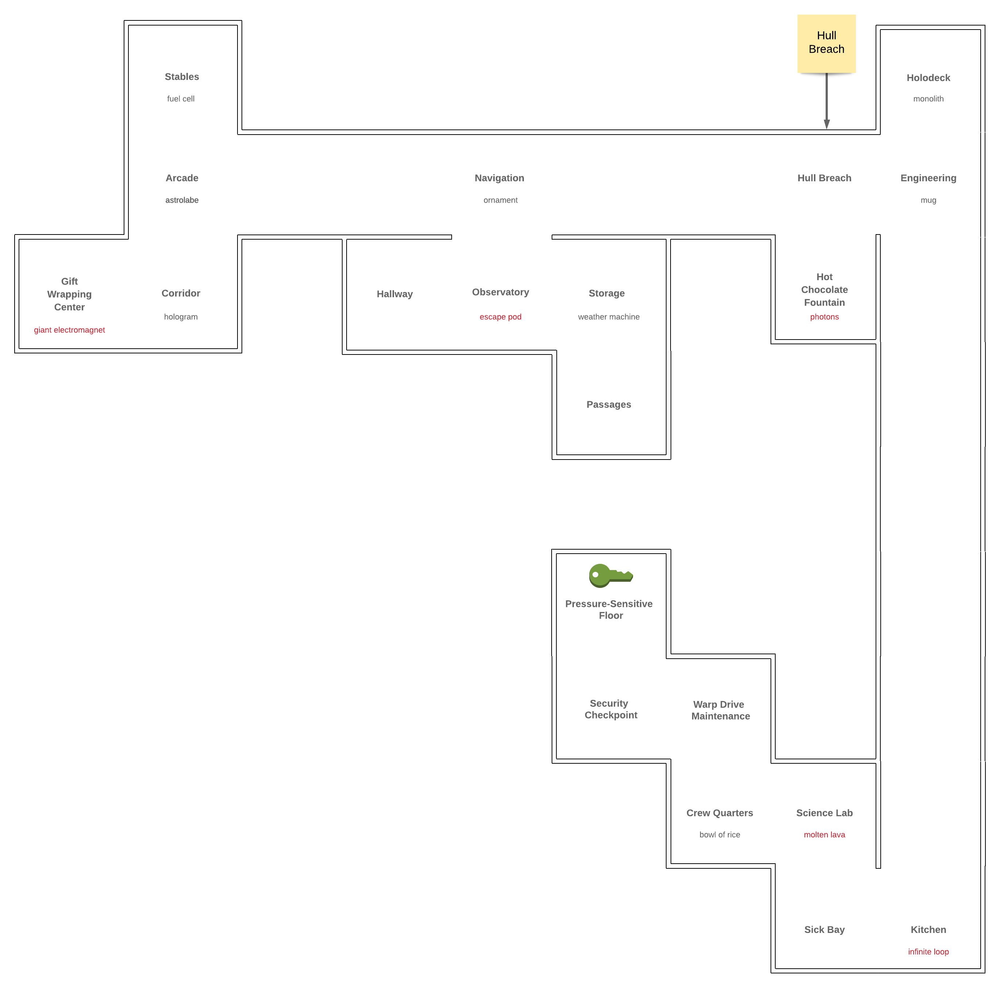

## Day 25

The final day! We're finally about to save Santa!

### Part 1

My initial impression of this is that we will have to do another BFS-type algorithm to navigate around the ship and get the right weight for our droid. 

I was wrong! This was super fun. I used a scanner for input from the console to manually control the droid. I explored the entire ship and catalogued each room.

```
A - Hull Breach
	You got in through a hole in the floor here. To keep your ship from also freezing, the hole has been sealed.
B - Engineering
	You see a whiteboard with plans for Springdroid v2.
	- mug
C - Holodeck
	Someone seems to have left it on the Giant Grid setting.
	- monolith	
D - Kitchen
	Everything's freeze-dried.
	- infinite loop
		You take the infinite loop.
		You take the infinite loop.
		You take the infinite loop.
		...
		Puts you in an infinite loop!
E - Hot Chocolate Fountain
	Somehow, it's still working.
	- photons
		You take the photons.

		It is suddenly completely dark! You are eaten by a Grue!
F - Navigation
	Status: Stranded. Please supply measurements from fifty stars to recalibrate.
	- ornament
G - Arcade
	None of the cabinets seem to have power.
	- astrolabe
H - Stables
	Reindeer-sized. They're all empty.
	- fuel cell
I - Corridor
	The metal walls and the metal floor are slightly different colors. Or are they?
	- hologram
J - Gift Wrapping Center
	How else do you wrap presents on the go?
	- giant electromagnet
		The giant electromagnet is stuck to you.  You can't move!!
K - Sick Bay
	Supports both Red-Nosed Reindeer medicine and regular reindeer medicine.
L - Science Lab
	You see evidence here of prototype polymer design work.
	- molten lava
		You take the molten lava.

		The molten lava is way too hot! You melt!
M - Crew Quarters
	The beds are all too small for you.
	- bowl of rice
N - Warp Drive Maintenance
	It appears to be working normally.
O - Security Checkpoint
	In the next room, a pressure-sensitive floor will verify your identity.
P - Pressure-Sensitive Floor
	Analyzing...
	A loud, robotic voice says "Alert! Droids on this ship are heavier than the detected value!" and you are ejected back to the checkpoint.

	A loud, robotic voice says "Analysis complete! You may proceed." and you enter the cockpit.
	Santa notices your small droid, looks puzzled for a moment, realizes what has happened, and radios your ship directly.
	"Oh, hello! You should be able to get in by typing 1073874948 on the keypad at the main airlock."
Q - Observatory
	There are a few telescopes; they're all bolted down, though.
	- escape pod
		You take the escape pod.

	You're launched into space! Bye!
R - Storage
	The boxes just contain more boxes.  Recursively.
	- weather machine
S - Passages
	They're a little twisty and starting to look all alike.
T - Hallway
	This area has been optimized for something; you're just not quite sure what.
```

```
Map
==========
 H      C
 G..F..AB
JI TQR E.
     S  .
        .
     P  .
     ON .
      ML.
       KD
==========
```

To more easily visualize this, I made a floor-plan of the ship :D.



Once I made a map of the place, I hardcoded commands to traverse the ship and pick up all the **safe** items and get to the `Security Checkpoint`. I then try automatically every combination of items until the door opens and we find Santa!

```
A loud, robotic voice says "Analysis complete! You may proceed." and you enter the cockpit. Santa notices your small droid, looks puzzled for a moment, realizes what has happened, and radios your ship directly. "Oh, hello! You should be able to get in by typing 1073874948 on the keypad at the main airlock."
```