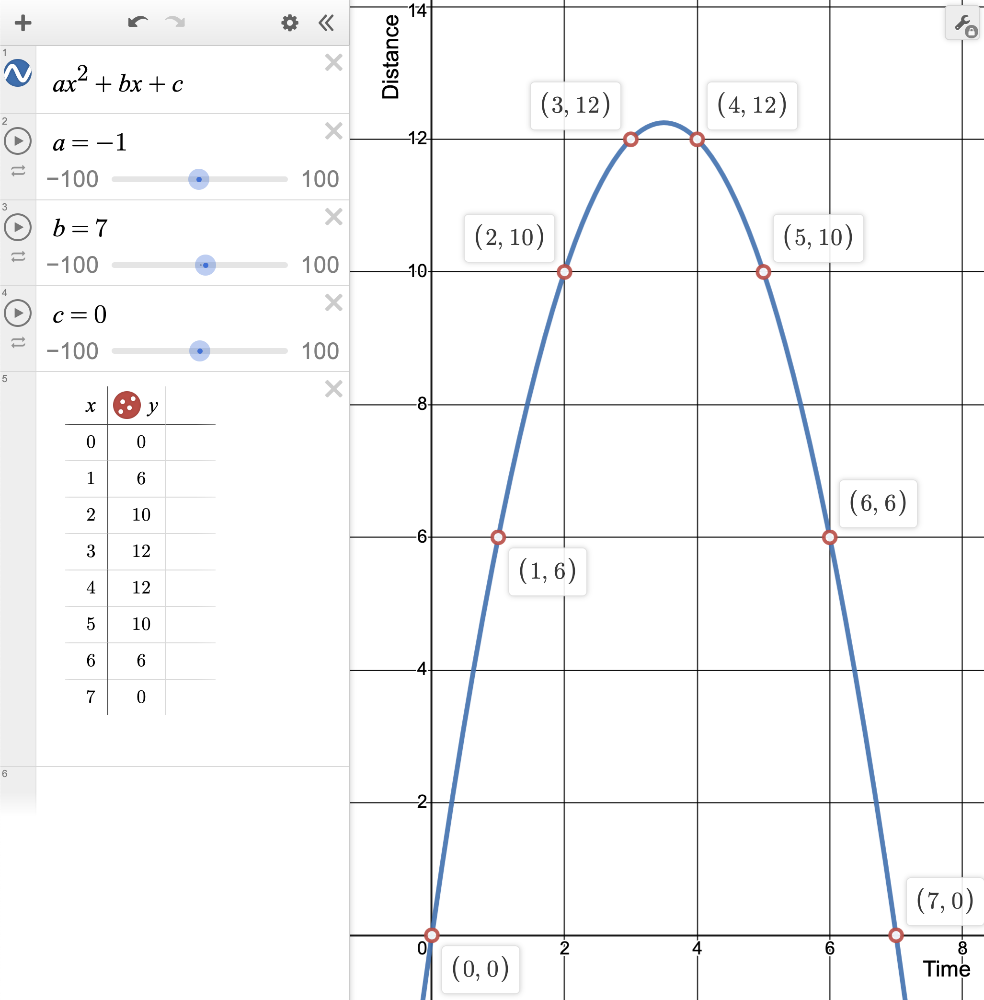
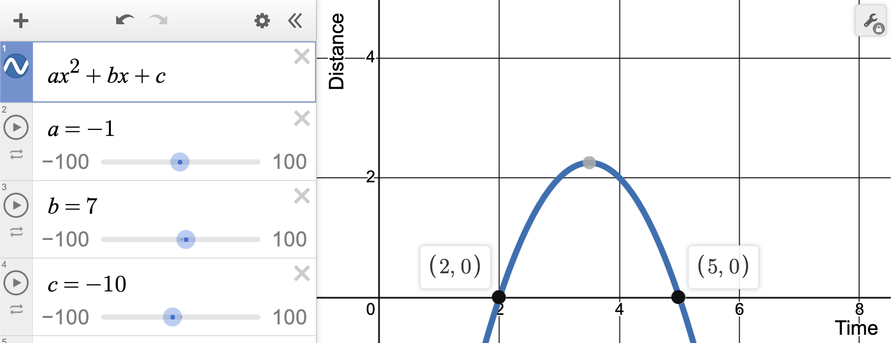

# Day 6

## Thoughts

Yay! Some math! I already had a solution ready when I read the problem, but wondered all the while if we'd need a math trick to solve it faster than brute force.

### Part 1

I kicked this one off with a quick brute force algorithm. 

1. Keep track of the resulting product of numbers of ways to win.
2. Loop through each race.
3. Loop through from time starting at 1 until 1 before the end time. We want to travel further than 0 millimeters. Got to push that button!
4. Calculate the remaining time after pushing the button as `raceDuration - timeToPushButton`, then the distance as `timeToPushButton * remainingTime`.
5. If the distance is further than the record, count it as one way to win.

### Part 2

I worried that we'd need to use a math trick for performance, but my brute force solution ran in 38 microseconds! However, I wasn't satisfied, so I explored better approaches.

First, I realized I could get run up to the first time we beat the record, then start from the end and find the last time we'd beat the record and get the difference between the two (and add one to be inclusive). This improved performance by 4x for my input.

But I wasn't satisfied with the naive approach. Plotting the points from the example, I realized we are dealing with a parabola. Using https://www.desmos.com, this is what it looks like.

And boy, did I want to use the algebra that I learned 18 years ago! Man, I feel old saying that.  

The equation for a parabola is:

$$y = ax^2 + bx + c$$

$a$ is the quadratic coefficient and basically represents the slope of the parabola. If it is negative, the parabola opens downward. If it is positive, the parabola opens upward. We are using a step time of 1 and we want the parabola to open downward, so we determine that $a = -1$.

$b$ is the linear coefficient and shifts the parabola left or right. We shift it to the right based on how much time we have for the race with $b = time$.

$c$ is the constant term and affects the $y$-intercept. To plot an entire race $c = 0$. If we hold the button down for 0 milliseconds, we only go 0 millimeters.

For the first sample race, we arrive at the following formula:

$$y = -x^2 + 7x$$

If $x$ represents **time** and $y$ represents **distance**, then we know that $y$ needs to equal `10` to beat the record of `9` millimeters. If we plug that in, we get $10 = -x^2 + 7x$. Now, here's the best part, we can now use the quadratic formula to solve for our $x$-intercepts!

$$x=\frac{-b\pm\sqrt{b^2-4ac}}{2a}$$

But here's one thing to remember, you first have to set the $y$-side of the equation to $0$ in order to get ready for the quadratic equation. This gets us $0 = -x^2 + 7x - 10$ where $c = -10$. This shifts our parabola down so we can solve for the $x$-roots where the parabola hits the $x$-axis. For our example, we get:

$$x=\frac{-7\pm\sqrt{-7^2-4(-1)(-10)}}{2(-1)}$$

Which reduces down to $x = 2$ and $x = 5$. So we know that holding the button down for 2 through 5 milliseconds beats the record! This is 4 ways to win the race. Here's what our resulting parabola looks like with the shift.

What this look like in code is `x2 - x1 + 1` to be inclusive of the final millisecond. Because we are dealing with integers and not floating point values, we need to take the ceiling of the second first intercept because we can only hold the button down for full milliseconds and not a fraction of a millisecond. 

This takes us from a processing time to solve Part 2 of 9ms down to 830ns. Nearly a 10,000x speed up!
