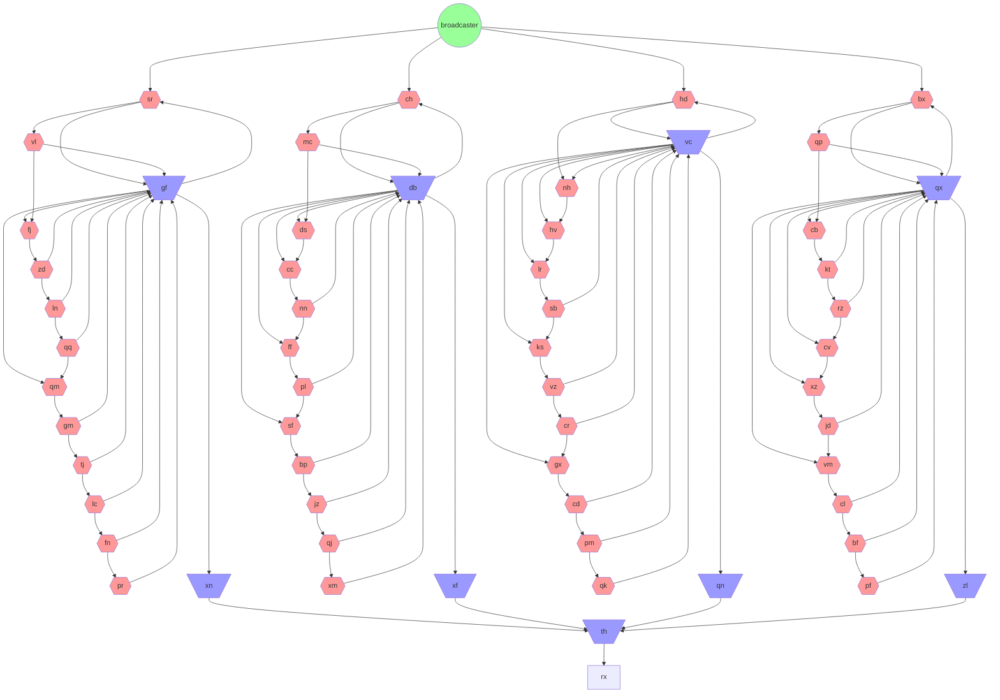

# Day 20

## Thoughts

I really enjoyed how much I was able to design a solution for today's puzzle! Parsing, planning, and setup took the most time.

### Part 1

1. Parse the input into a map of modules. Initialize each module, setting **flip-flop** states to **off** and **conjunction** memory all to **low pulses**. I did this by struct composition and an interface to initialize each module type.
2. Set low and high counters to 0.
3. Loop 1000 times.
   1. Start with a button signal in a queue.
   2. Count whether the signal's pulse is low or high.
   3. Process the signal. By using composition, it made this very easy to process the pulses by module type.
4. Return the product of the low and high counts.

### Part 2

I really didn't like how there were no sample inputs to test with. Luckily, the actual input wasn't very large. If you take a look, `rx` behaves very much like `output` in one of the samples, where it is an **untyped module**. We can see that there is one **conjunction** module that is the input to `rx` and there are several inputs into that conjunction module.

We know that a **conjunction** module can only deliver a **low pulse** if all its inputs have had a **high pulse**. So we must find the first button press for each input to the **conjunction** module when they deliver a **high pulse**. Once we've done this, we can get the least common multiple of each of those values to determine the first time when all of them will deliver a **high pulse** at the same time.

1. Parse the input as before.
2. Get the **conjunction** module that is the input to `rx`. For unit tests, I added a check if there is no input for `rx`, then we return `-1`.
3. Create a map of the first times we encounter a high pulse for each input module.
4. Loop until we've encountered a high pulse for each input module.
   1. Start with a button signal in a queue.
   2. Process each signal.
   3. Check if the memory for our **conjunction module** had any new high pulses. Add them to our map.
5. Return the least common multiple of each of the first encounters with high pulses on the inputs.

### Visualization

