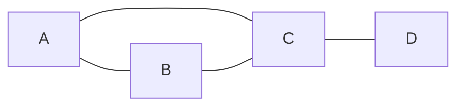
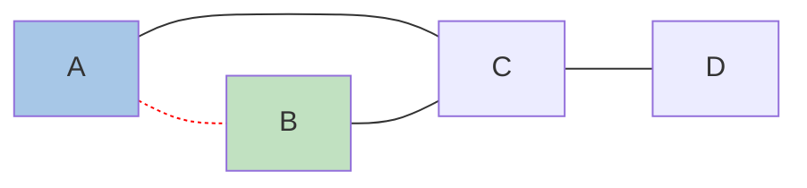
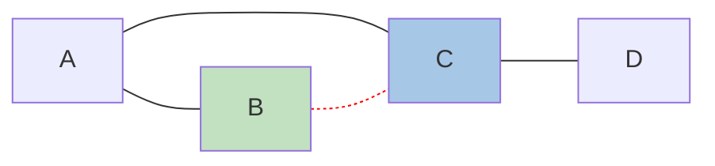
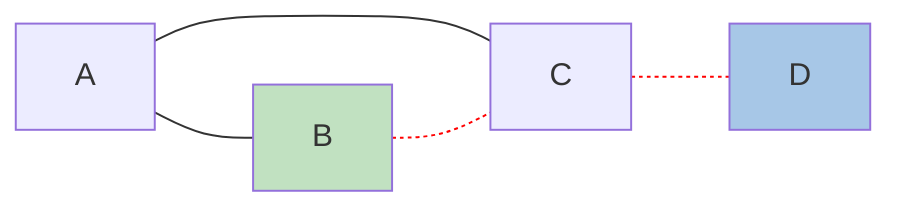
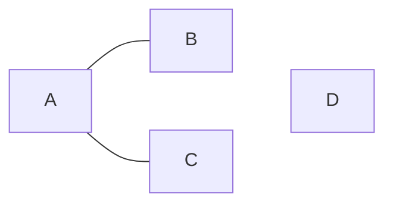
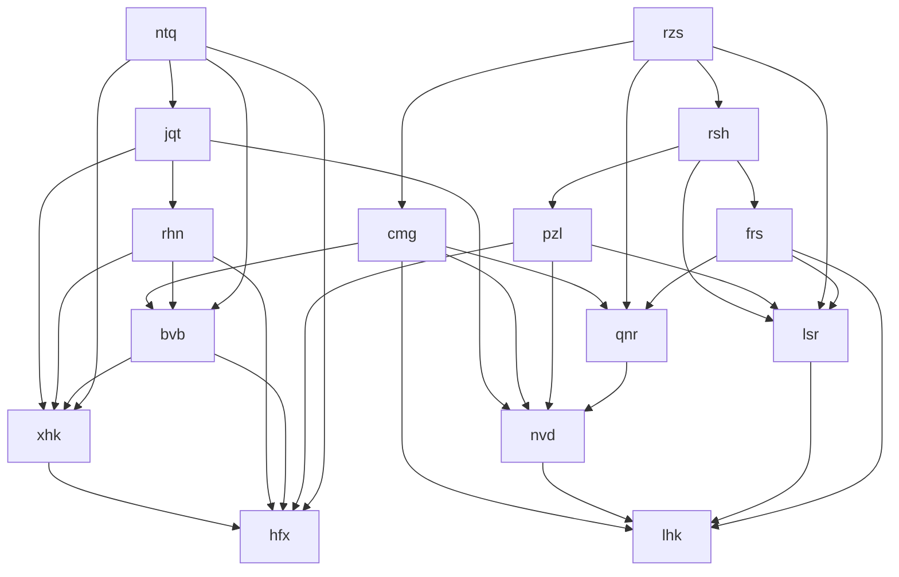
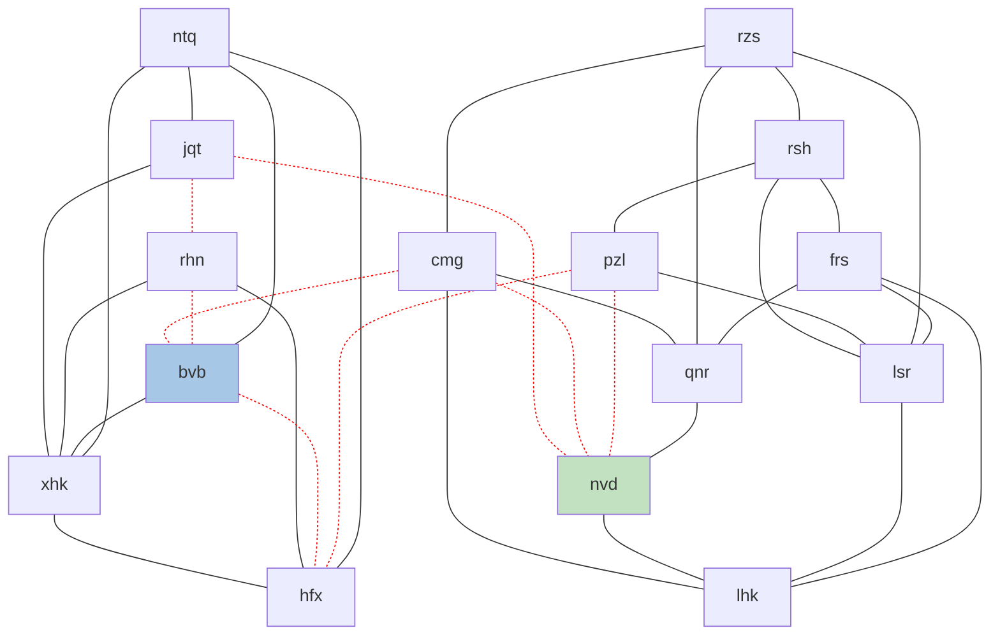
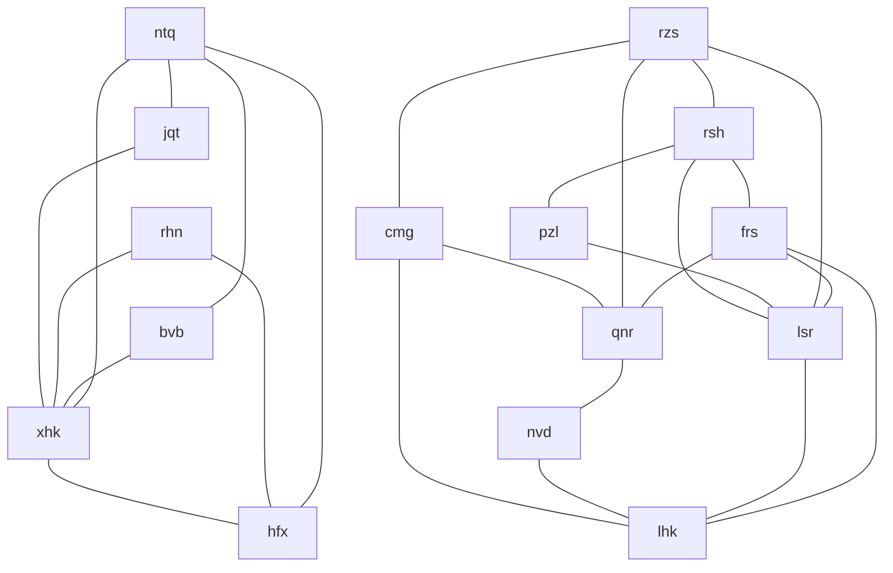

# Day 25

## Thoughts

This was perhaps the most challenging Christmas-day puzzle I've seen so far. I think I've also felt exhausted with the last few puzzles just from the amount of learning I was doing. I really enjoyed it, but just struggled to get all the way to Day 25.

### Part 1

There has been a similar class of problems in the past. This is a variant on a [flow network](https://en.wikipedia.org/wiki/Flow_network). The difference is this is an undirected graph with no specified source and sink. In a previous year, there was a puzzle where we needed to find the maximum flow through a network of caves, using the [Ford–Fulkerson algorithm](https://en.wikipedia.org/wiki/Ford%E2%80%93Fulkerson_algorithm).

I read hints of how people solved this on Reddit via the [Stoer-Wagner algorithm](https://en.wikipedia.org/wiki/Stoer%E2%80%93Wagner_algorithm) to find the minimum cut in a graph. The algorithm is simplified because we are given the number of cuts to make (3).

1. Parse the input into an undirected graph of nodes. Edges should go both ways from each node.
2. Pick a random source node.
3. Loop through every other node as a sink (target) node.
   1. Cut 3 paths and check if the cuts create separate graphs. We basically perform a BFS search `cuts + 1` times by removing shortest paths for each cut, then determining if we can reach the sink from the source on the final search.
      1. Perform a BFS search to find the shortest path of edges from the source to the sink.
      2. Upon reaching the sink, we have the shortest path. Remove that path. I do this by using a map of visited edges and store the previous edge back to the source.
   2. Once we've split the graph, perform two separate searches for the source and the sink to no particular node so they visit all nodes in the graph. If their total nodes equal the original nodes we started with (meaning we didn't completely cut out any nodes), then return the size of the two graphs multiplied by each other.

Here's a simplified example. Say we have only 4 nodes labeled `A` through `D`. And we want to make at most 1 cut to get two separate graphs. We can easily see that the edge between `C` and `D` is where we want to make the cut.

Going through our algorithm, we can pick a random node as our source. Let's choose `B`. Looping through each node as a sink (target), we perform a BFS search to get the shortest path and cut off the path. Choosing `A`, here's what this looks like.

After doing this, we perform another BFS search to see if we can still reach the sink from the source. If we cannot, we know the cut was effective in removing a group from the graph. Because we can still reach, we move on to select another sink. `C` as the sink:

Again, we can still reach the sink (`C`) from the source (`B`). `D` as the sink:

With this cut, we end up with two separate graphs **and** `D` is not reachable from `B`. We now know that we found a cut that splits the graph.

Let's look at a larger example. The sample input looks like this:

Looking at this graph, it's pretty clear that we want to cut a line right down the middle, on the left of `cmg`. This would result in two separate graphs by cutting only 3 wires.

Here's what our resulting graph ends up looking like.

Notice that we ended up cutting full paths rather than individual wires. The puzzle asks us to find the number of nodes in each group, not the specific wires that need to be cut. Therefore, it's possible that we might completely cut a node off from the rest of the graph or split into more groups than we want. Therefore, when we group the nodes we should perform one final check to ensure the size of the two sub-graphs is equal to the size of the original.

### Part 2

As usual, there's no Part 2, just click the button! Merry Christmas!
